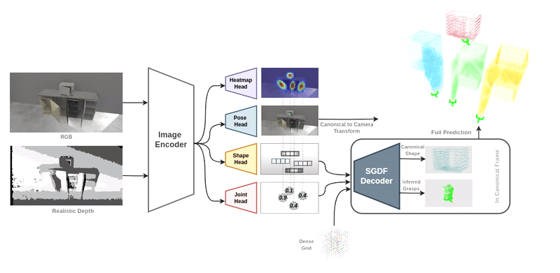
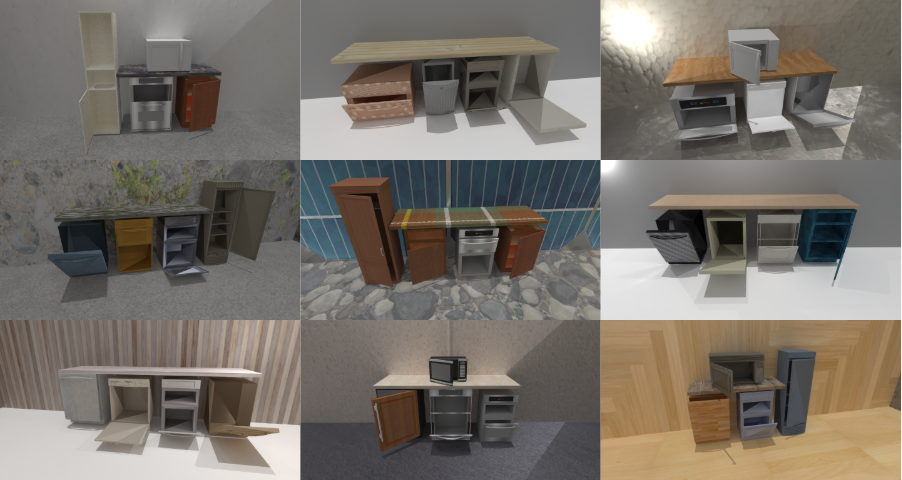
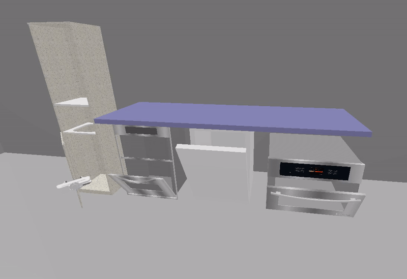

# CenterArt: Joint Shape Reconstruction and 6-DoF Grasp Estimation of Articulated Objects

Repository provides the source code for the paper "CenterArt: Joint Shape Reconstruction and 6-DoF Grasp Estimation of Articulated Objects":

### [arXiv](https://arxiv.org/abs/2404.14968) | [Video](https://www.youtube.com/watch?v=yhFBh0kZs5Y)


## Installation

```bash
conda create --name centerart_env python=3.8
conda activate centerart_env
pip install torch==1.13.1+cu117 torchvision==0.14.1+cu117 torchaudio==0.13.1 --extra-index-url https://download.pytorch.org/whl/cu117
git clone git@github.com:PRBonn/manifold_python.git
cd manifold_python
git submodule update --init
make install
cd CenterArt
pip install -r requirements.txt
```

## Data Generation
Download the articulated objects from [PartNet-Mobility dataset](https://sapien.ucsd.edu/downloads). Collect the desired urdf objects in `datasets/urdfs` directory. For grasp label generation, check out [this repo](https://github.com/Sassanmtr/articulated_grasp). Run the following script to generate sdf values:

```bash
python scripts/sdf_generator.py
```
The datasets directory should be as follow:

```shell
datasets
|-- urdfs
|-- grasps
|-- sdfs_value
|-- sdfs_point
```

First, generate a json file for collected objects by running:

```bash
python scripts/json_file_creator.py
```

Split the data to train and validation sets:

```bash
python scripts/sgdf_data_split.py
```

Generate sgdf decoder dataset by running:

```bash
python scripts/make_sgdf_dataset.py
```
Generate rgb encoder dataset by running:

```bash
python scripts/make_rgb_single_dataset.py # for scenes with single articulated object
python scripts/make_rgb_multiple_dataset.py # for scenes with multiple articulated objects
```



## Pretrained Weights Download 

Please download the pretrained weights:   
[sgdf decoder](https://drive.google.com/drive/folders/1-p3NBu_e1iOvjQFyVISMDkXTR9meorQ9?usp=sharing): Extract and place in the `ckpt_sgdf` folder, at the root of the repository.   
[rgb encoder (single objects)](https://drive.google.com/drive/folders/1v-T7xUfx9KbFXPoEX00OCnokYUyaZr7S?usp=sharing): Extract and place in the `ckpt_rgb` folder, at the root of the repository.     
[rgb encoder (multiple objects)](https://drive.google.com/drive/folders/1yjGmzj9bwvI8mDAkJyK846JU5JA16_VC?usp=sharing): Extract and place in the `ckpt_rgb` folder, at the root of the repository.

## Evaluation

To reproduce the results from the paper (Table I), do the following. If you want to evaluate a different checkpoint, remember to change the `--rgb-model` argument.

```bash
python scripts/evaluate.py #(To get success rate)
python scripts/evaluate_relaxed.py #(To get relaxed success rate)
```


## Training

To train your own models instead of using the pretrained checkpoints, do the following:

```bash
python scripts/train_sgdf.py
```

Modify `configs/rgb_train_specs.json` -> `EmbeddingCkptPath` with the checkpoint id that you just trained. Now you can use those embeddings to train the rgbd model:

```bash
python scripts/train_rgbd.py
```

## Citation

```
@inproceedings{mokhtar2024centerart,
  title={CenterArt: Joint Shape Reconstruction and 6-DoF Grasp Estimation of Articulated Objects},
  author={Mokhtar, Sassan and Chisari, Eugenio and Heppert, Nick and Valada, Abhinav},
  booktitle={ICRA 2024 Workshop on 3D Visual Representations for Robot Manipulation}
}
```

## Feedback

For any feedback or inquiries, please contact sassan.mtr@gmail.com